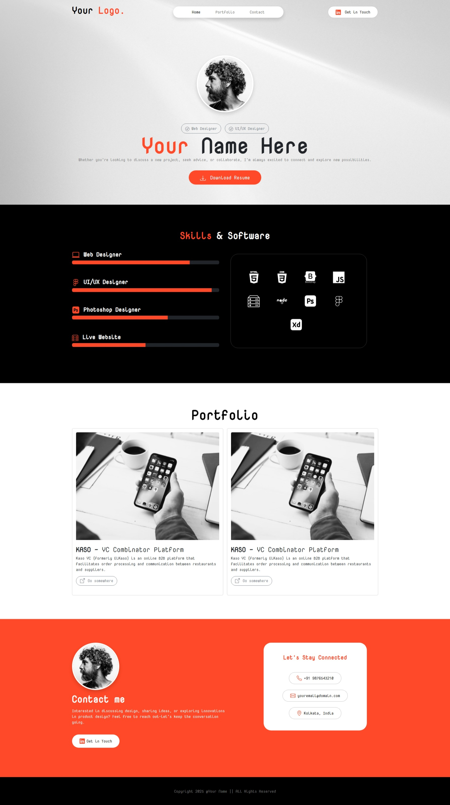

# Portfolio [Project 2 (FSWD Foundation)]

A modern, responsive personal portfolio website built with Bootstrap 5, showcasing professional skills, projects, and personal achievements with smooth animations and a clean, professional design.

## ✨ Features

### Core Portfolio Features

- **Responsive Design**: Fully responsive layout that works seamlessly across all devices
- **Modern UI**: Clean and professional design using Bootstrap 5 framework
- **Navigation**: Intuitive navigation with smooth transitions between sections
- **Portfolio Showcase**: Dedicated sections for projects, skills, and experience
- **Contact Integration**: Contact section for professional inquiries and opportunities
- **Optimized Performance**: Lightweight and fast-loading pages
- **Animated Elements**: Smooth animations using Animate.css library

### Interactive Elements

- **Hero Section**: Eye-catching hero area with background imagery
- **Profile Section**: Professional profile presentation
- **Project Gallery**: Showcase of personal and professional projects
- **Skills Display**: Technical skills and competencies presentation
- **Contact Form**: Functional contact section for inquiries

## 🛠️ Tech Stack

- **Framework**: Bootstrap 5.3.2
- **Language**: HTML5 & CSS3
- **JavaScript**: Vanilla JavaScript with Bootstrap components
- **Animation**: Animate.css 4.1.1
- **Icons**: Bootstrap Icons
- **Styling**: Custom CSS with Bootstrap utilities
- **Images**: Optimized responsive images

## 📸 Preview

### Portfolio Homepage



## 📁 Project Structure

```
bs5-project-portfolio/
├── assets/                 # Static assets (images, logos)
│   ├── preview/           # Page preview screenshots
│   │   └── preview.jpeg   # Portfolio preview
│   ├── hero-bg.jpg        # Hero section background
│   ├── logo.ico/png       # Personal logo/brand
│   ├── profile-img.jpg    # Profile picture
│   └── post-img.jpg       # Project/Post images
├── css/                   # Stylesheets
│   ├── bootstrap.min.css  # Bootstrap framework
│   └── style.css          # Custom styles
├── js/                    # JavaScript files
│   ├── bootstrap.bundle.min.js  # Bootstrap JS
│   └── script.js         # Custom scripts
├── index.html             # Main portfolio page
├── LICENSE                # MIT License file
└── README.md              # Project documentation
```

## 🚀 Getting Started

### Prerequisites

- Modern web browser (Chrome, Firefox, Safari, Edge)
- Local web server (optional, for development)

### Installation

1. Clone the repository:

```bash
git clone https://github.com/citindia/bs5-project-portfolio.git
cd bs5-project-portfolio
```

2. Open `index.html` in your web browser to view the portfolio

## 🎯 Usage

### Navigation

- Use the navigation menu to jump between different sections
- Smooth scrolling animations for better user experience
- Responsive hamburger menu on mobile devices

### Sections

- **Home**: Hero section with call-to-action
- **About**: Personal information and background
- **Skills**: Technical and professional skills showcase
- **Projects**: Portfolio of completed projects
- **Contact**: Contact form and professional links

### Theme Features

- Responsive design adapts to all screen sizes
- Smooth animations and transitions
- Professional color scheme and typography
- Interactive hover states and micro-interactions

## 🔧 Development

### Code Style

- Semantic HTML5 markup for accessibility
- Bootstrap 5 best practices
- Responsive-first design approach
- Clean, maintainable CSS architecture
- Optimized image assets

### Component Architecture

- Bootstrap 5 component-based structure
- Modular CSS organization
- JavaScript for interactive elements
- Responsive grid system implementation

### UI Framework

- Bootstrap 5 framework for consistent design
- Custom CSS for unique styling
- Animate.css for smooth animations
- Responsive design patterns
- Cross-browser compatibility

## 📄 License

This project is licensed under the MIT License - see the [LICENSE](LICENSE) file for details.

## 👤 Author

**Saikat Sardar**

- GitHub: [@citindia](https://github.com/citindia)
- Project Homepage: [https://github.com/citindia/bs5-project-portfolio](https://github.com/citindia/bs5-project-portfolio)
